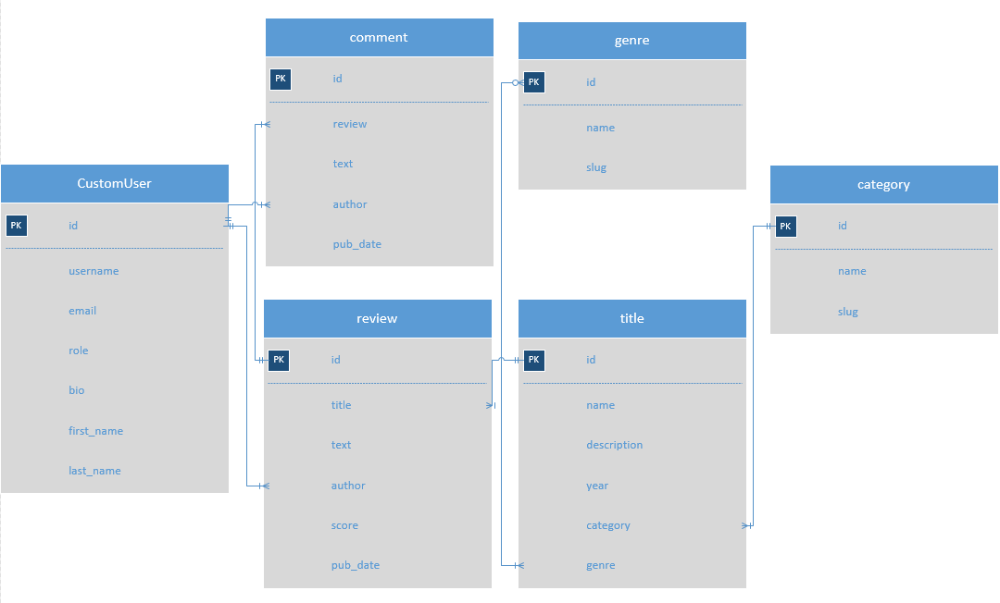

## API YAMDB.
### Финальный проект 10-го спринта.
### Яндекс.Практикум. 5-я когорта pythonplus.
___
### Команда: Андрей Федотов(team lead), Елена Денисова

___
### REST API сервис.

___
Сервис для отзывов к произведениям.

### Схема БД:


## Как запустить проект:

Клонировать репозиторий и перейти в него в командной строке:

```
git clone https://github.com/aafedotov/api_yamdb.git
```

```
api_yamdb
```

Cоздать и активировать виртуальное окружение:

```
python3 -m venv env
```

```
source env/bin/activate
```

Установить зависимости из файла requirements.txt:

```
python3 -m pip install --upgrade pip
```

```
pip install -r requirements.txt
```

Выполнить миграции:

```
python3 manage.py migrate
```

Запустить проект:

```
python3 manage.py runserver
```

## Примеры запросов к API:

```angular2html
GET
http://127.0.0.1:8000/api/v1/titles/

Получение списка всех произведений
```

```angular2html
GET
http://127.0.0.1:8000/api/v1/titles/{title_id}/reviews/

Получение списка отзывов к произведению
```

```angular2html
POST
http://127.0.0.1:8000/api/v1/auth/signup/

Регистрация пользователей, получение кода подтверждения на e-mail
```

### Подробная информация по Api в ReDoc.